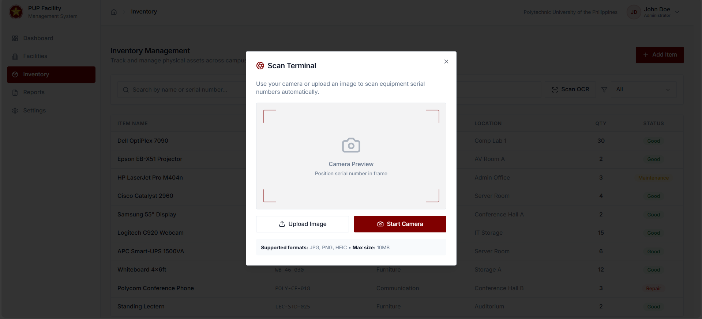
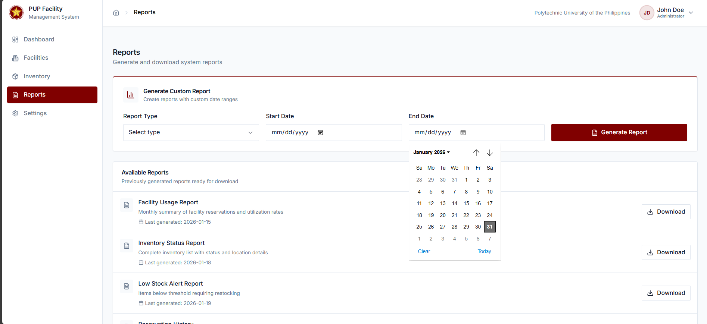

# Facility Reservation and Inventory Management System with Optical Character Recognition (OCR) Technology

**Preview**

<table style="width:100%; max-width:900px; border-collapse:collapse;">
	<tr>
		<td style="padding:6px; width:50%; vertical-align:top;">
			<a href="./public/preview.png">
				
			</a>
		</td>
		<td style="padding:6px; width:50%; vertical-align:top;">
			<a href="./public/previeww.png">
				
			</a>
		</td>
	</tr>
	<tr>
		<td style="padding:6px; width:50%; vertical-align:top;">
			<a href="./public/preview3.png">
				
			</a>
		</td>
		<td style="padding:6px; width:50%; vertical-align:top;">
			<a href="./public/preview4.png">
				
			</a>
		</td>
	</tr>
</table>

**What it is:** A Web-Based Integrated Facility Reservation and Inventory Management System with optional OCR support — a Capstone project built for Polytechnic University of the Philippines, San Pedro Campus.

**Proposal summary:** This system centralizes facility reservations, automates inventory tracking, and provides reporting to replace manual/paper workflows.

**Tech stack**
- **Frontend:** React 18 + TypeScript
- **Bundler / Dev:** Vite
- **UI:** shadcn/ui (Tailwind CSS + Radix primitives)
- **Styling:** Tailwind CSS
- **Icons:** lucide-react
- **Routing:** react-router-dom
- **Data fetching / cache:** @tanstack/react-query
- **Forms / validation:** react-hook-form, zod
- **Charts:** recharts
- **Notifications:** sonner
- **OCR:** (placeholder) tesseract.js or other OCR integration

Files of interest
- Main layout: [src/components/layout/AppLayout.tsx](src/components/layout/AppLayout.tsx)
- UI primitives: [src/components/ui](src/components/ui)
- Pages: [src/pages](src/pages)
- Entry point: [src/main.tsx](src/main.tsx)
- Public assets (logo, preview): add images to the `public/` folder and reference them as `/PUPLogo.png` or `/preview.png`.

Quick setup (Windows / macOS / Linux)

1. Prerequisites: Node.js (18+ recommended) and npm
2. Install dependencies

```bash
npm install
```

3. Start dev server (hot reload)

```bash
npm run dev
```

4. Build for production

```bash
npm run build
```

5. Preview the production build

```bash
npm run preview
```