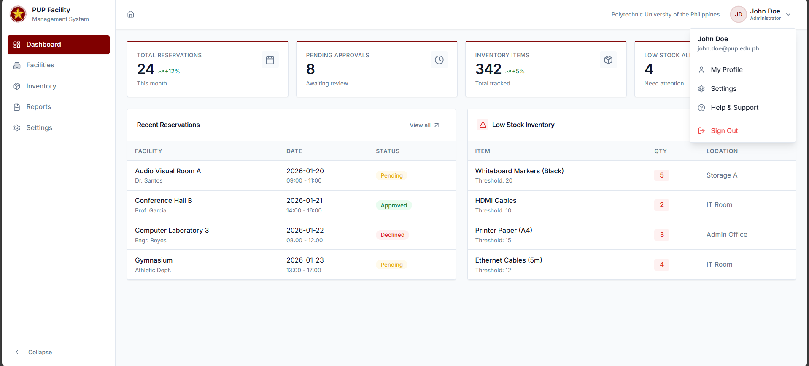
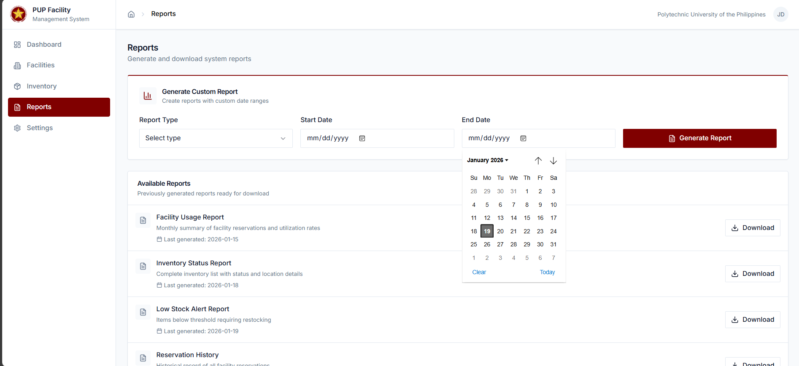
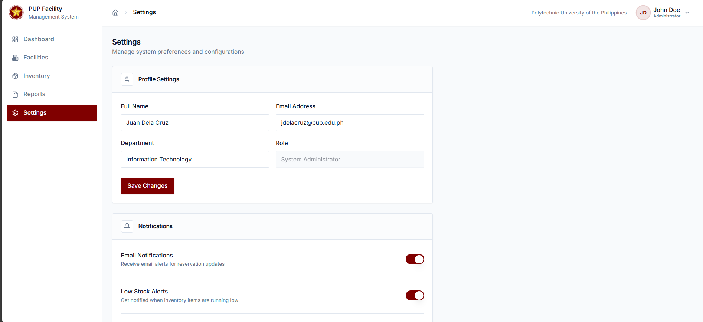
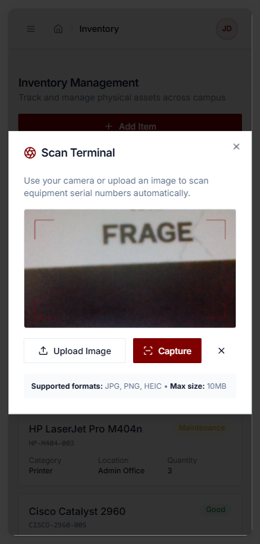
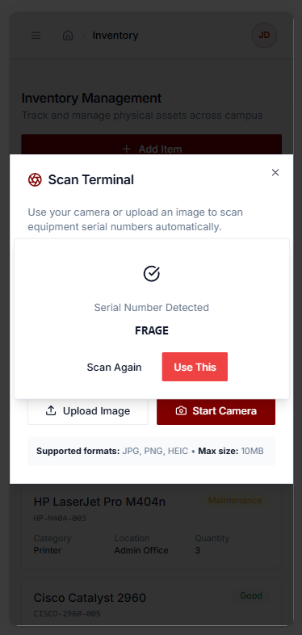

# PUP-SP Smart Assets: An Integrated Facility Reservation and Inventory Management System utilizing VLM-Based OCR and Cloud-Integrated Web Architecture


This repository is a Capstone prototype for the Polytechnic University of the Philippines, San Pedro Campus. It includes facility reservation flows, inventory management, and a prototype OCR scanner to detect equipment serial numbers from images or camera captures.

## Preview

Below are the available preview images from the `public/` folder.

<table style="width:100%; max-width:1000px; border-collapse:collapse;">
	<tr>
		<td style="padding:6px; width:33%; vertical-align:top;">
			<a href="./public/preview1.png"></a>
		</td>
		<td style="padding:6px; width:33%; vertical-align:top;">
			<a href="./public/preview2.png"></a>
		</td>
		<td style="padding:6px; width:33%; vertical-align:top;">
			<a href="./public/preview3.png"></a>
		</td>
	</tr>
	<tr>
		<td style="padding:6px; width:33%; vertical-align:top;">
			<a href="./public/preview4.png"></a>
		</td>
		<td style="padding:6px; width:33%; vertical-align:top;">
			<a href="./public/preview5.png"></a>
		</td>
		<td style="padding:6px; width:33%; vertical-align:top;">
			<a href="./public/preview6.png"></a>
		</td>
	</tr>
	<tr>
		<td style="padding:6px; width:33%; vertical-align:top;">
			<a href="./public/preview7.png"></a>
		</td>
		<td style="padding:6px; width:33%; vertical-align:top;">&nbsp;</td>
		<td style="padding:6px; width:33%; vertical-align:top;">&nbsp;</td>
	</tr>
</table>

## What changed (Recent updates)
- Integrated `ProfileDropdown` into the app header and added a sonner toast on sign-out.
- Improved Dashboard stat dialog UI (icon alignment, subtitle, accessible close behavior) while keeping the stat grid unchanged.
- Implemented Inventory OCR prototype:
	- Camera capture and file upload support.
	- Canvas snapshot -> blob -> OCR pipeline using `tesseract.js` (client-side) for now.
	- Scanning animation and result card UI with actions (`Scan Again`, `Use This`).
	- Stops camera when dialog closes and when processing begins.
	- Sonner toasts for success/failure and a specific "No serial number detected" notification when OCR returns no matches.

## OCR Notice
Currently the prototype uses `tesseract.js` for client-side OCR. This is adequate for offline prototyping but not as accurate or scalable as a cloud OCR service. NOTE: To be changed with DeepSeek (or another cloud OCR provider) for production-grade detection and reliability.

## Tech stack
- **Frontend:** React + TypeScript
- **Dev / Bundler:** Vite 
- **UI:** shadcn/ui (Tailwind + Radix)
- **Notifications:** sonner
- **OCR (prototype):** tesseract.js (see notice above)

## Files of interest
- Main layout: [src/components/layout/AppLayout.tsx](src/components/layout/AppLayout.tsx)
- Profile dropdown: [src/components/layout/ProfileDropdown.tsx](src/components/layout/ProfileDropdown.tsx)
- Inventory + OCR: [src/pages/Inventory.tsx](src/pages/Inventory.tsx)
- Dashboard dialogs: [src/pages/Dashboard.tsx](src/pages/Dashboard.tsx)
- UI primitives: [src/components/ui](src/components/ui)
- Entry point: [src/main.tsx](src/main.tsx)

## Quick setup
1. Prerequisites: Node.js (18+ recommended) and npm
2. Install dependencies

```bash
npm install
```

3. Start dev server

```bash
npm run dev
```

4. Build for production

```bash
npm run build
```

5. Preview the production build

```bash
npm run preview
```
